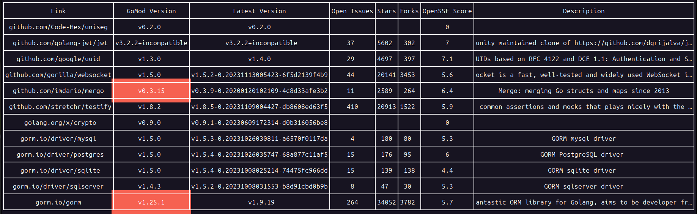

# Modcheck

If you're reading this, then Godspeed.

## Why

I made this tool to assess the state of a project's dependencies quickly. I wanted to know if any dependencies were not being used or were not being used by any other dependencies. I also wanted to know how widespread the dependencies were on GitHub, the codebase's quality, and the number of outstanding issues.

## Installation

`go install github.com/euanwm/modcheck/cmd/modcheck@latest`

## Usage

`modcheck <path/to/folder/with/go.mod/file>`

The modcheck tool can be used in two ways:

- `modcheck`: without arguments, it will check the go.mod file in the current directory
- `modcheck /path/to/folder/`: with a path to a folder containing a go.mod file, it will check that go.mod file.

## Example output

## Development requirements

- [GNU Make](https://www.gnu.org/software/make/)
- [Go](https://golang.org/), +v1.21 and above
