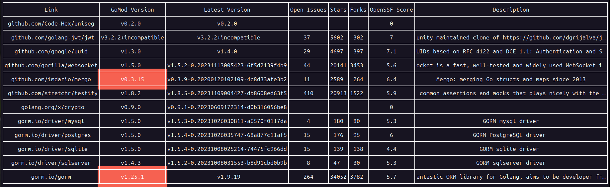

If you're reading this, then godspeed.

# Why did I make this?
I made this tool so I could quickly assess the state of a project's dependencies. I wanted to know if there were any dependencies that were not being used, or if there were any dependencies that were not being used by any other dependencies. I also wanted to know how popular the dependencies were on GitHub along with the quality of the codebase and the number of outstanding issues.

## Requirements
- [GNU Make](https://www.gnu.org/software/make/)
- [Go](https://golang.org/), +v1.21 and above
- [Linux](https://www.kernel.org/), it doesn't currently support other operating systems. I'll work on it if there's a demand for it.

## Installation
```bash
make install
```

## Usage
The modcheck tool can be used in two ways:
- Without any arguments, it will check the go.mod file in the current directory.
```bash
modcheck
```
- With a path to a folder containing a go.mod file, it will check that go.mod file.
```bash
modcheck /path/to/folder
```

## In-Action Screenshot


